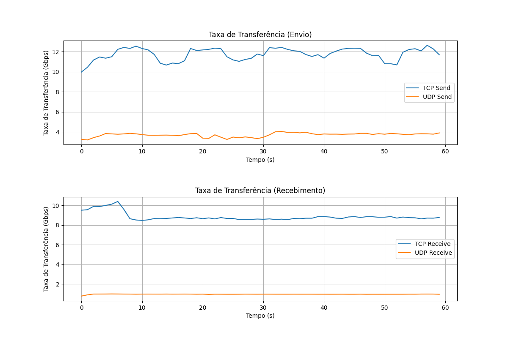

# Network Performance Measurement

This repository contains a Python script for measuring network performance using the iperf3 tool.

## Requirements

- Python 3.x
- Decouple
- Matplotlib
- Numpy
- Iperf3

## Installing

1. Clone this repository: `git clone https://github.com/avandocampos/iperf3_bandtest.git`
2. Navigate to the cloned directory: `cd iperf3_bandtest`
3. Install requirements: `python -m pip install -r requirements.txt`
4. Create a .env file with some variables information: `touch .env`
    - The <code>.env</code> files must contain the following variables in example bellow:

            REMOTE_HOST=172.30.118.72
            PORT=5001
            TIME=60
            TIMEWAIT=60
            SMTP_SERVER=smtp.gmail.com
            SMTP_PORT=587
            SMTP_USERNAME=sender_email@gmail.com
            SMTP_PASSWORD=sender_password
            TO_EMAIL=destination_email@gmail.com

### Optional tasks

1. Create a virtual environment: `python -m venv env`
2. Activate: `source env/bin/activate`
3. Install requirements inside them: `python -m pip install -r requirements.txt`

## Running

1. Run <code>iperf3</code> in server side: `iperf3 -s -p PORT `
    - Make sure that **PORT** is the same in <code>.env</code> file.
    - If you want to see output in server side, append <code>--json</code> to command above.
2. Run <code>client_iperf3.py</code> in client side: `python client_iperf3.py`

## Usage Example

## File structure

- `client_iperf3.py`: Python script that realize TCP and UDP tests in client side;
- `email_sender.py`: Send email with some data and graphs of measurement test;
- `email_text.py`: Email body from <code>html</code> file;
- `graph_gen.py`: Python script for generating graphs from JSON data;
- `results.json`: JSON file containing the results of the network performance tests.

## Contributing

Contributions are welcome! If you find a bug or have a feature request, please open an issue on GitHub. If you'd like to contribute code, please fork the repository and submit a pull request.

## Authors

- Avando Campos

## License

This project is licensed under the Apache Licence 2.0 - see the [LICENSE.md](LICENSE.md) file for details.
